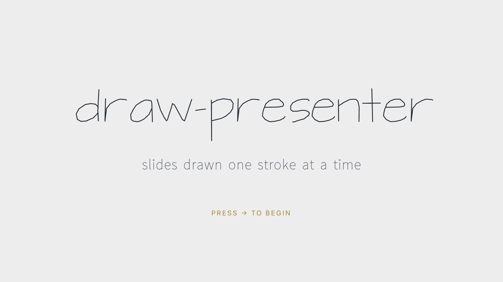
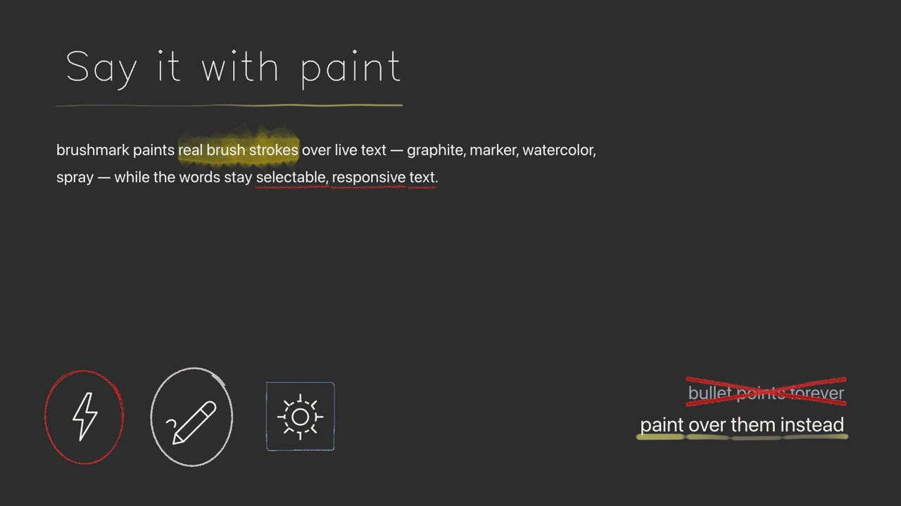
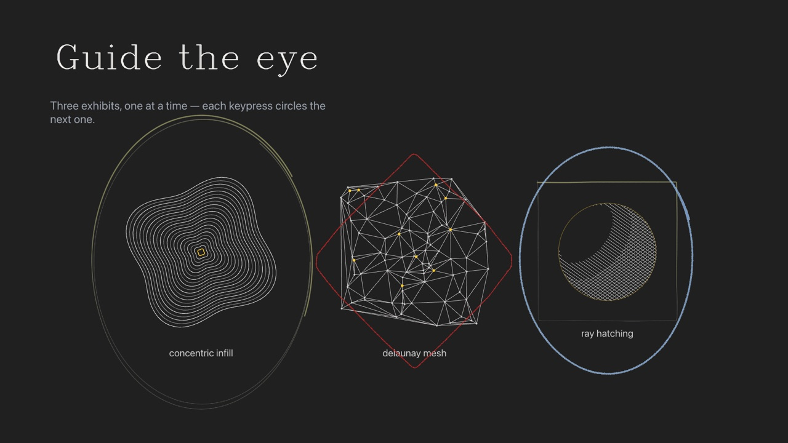
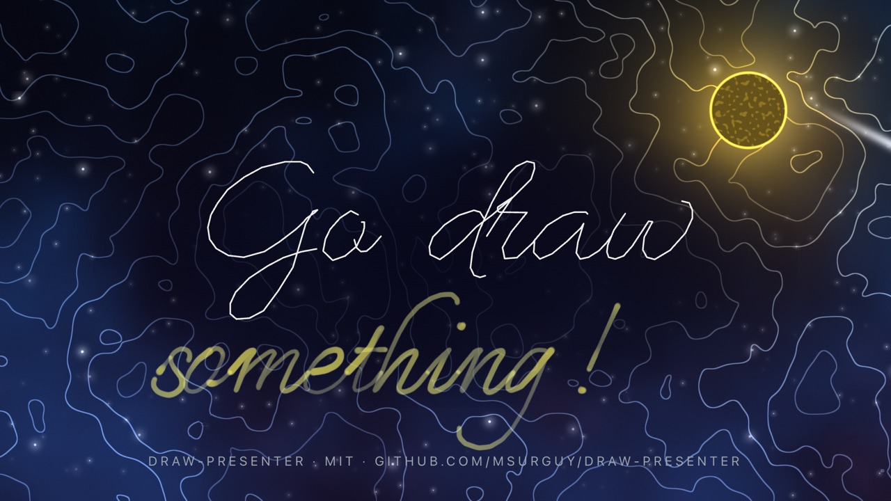
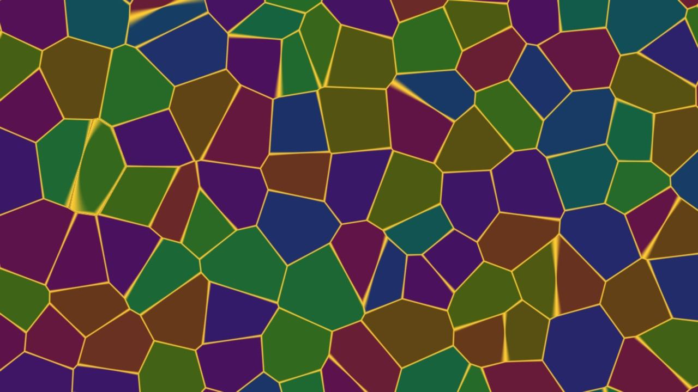
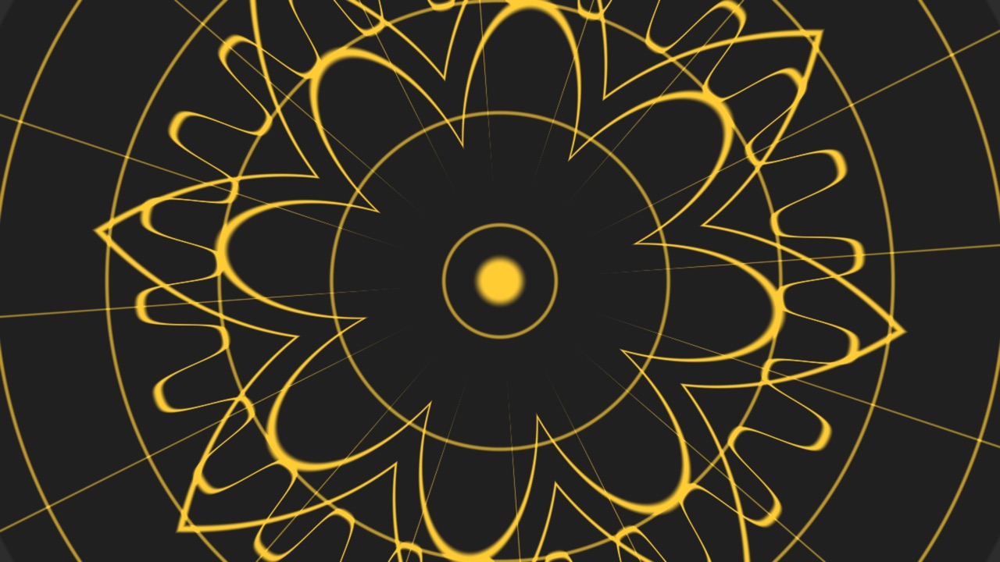

# draw-presenter

**Slides drawn one stroke at a time.** A presentation system for people who
would rather sketch than bullet-point: single-line Hershey fonts that write
themselves letter by letter, real brush strokes painted over live text,
diagrams that draw in block by block, WGSL shader transitions, and a visual
editor that writes plain React files you can keep hand-editing.

<p align="center">
  
  
  
  
  
  
</p>

## Why

Most slide tools animate rectangles. draw-presenter animates *pen paths*:
every glyph is an open polyline, every emphasis is a brush stroke, and every
build step is a line being drawn while you talk. It leans into the plotter /
hand-drawn look on purpose — dark paper, thin bright ink, one gold accent.

- **HersheyText** — 67 bundled single-line SVG fonts (Hershey, EMS, Cutlings,
  Relief, Shriinivas, Routed Gothic) written stroke by stroke, sequential or
  overlapping, any GSAP ease.
- **BrushText** — a real brush (marker, pencil, charcoal, crayon…) retraces the
  font's pen strokes, powered by [brushmark](https://github.com/msurguy/brushmark)
  and p5.brush.
- **BrushReveal** — underline, highlight, circle, contour, box, bracket,
  strike-through, spotlight dimming and self-erasing marks over text, SVG or images.
- **Appear** — entrances and build steps on one paused GSAP timeline per slide.
- **Mermaid** — hand-drawn flowcharts that reveal one block per keypress.
- **VideoLayer**, **Img**, **SvgIcon** (draw-on line icons), **ThreeScene**
  (imperative Three.js), **ShaderLayer** (fullscreen WGSL via vgpu).
- **20 transitions** — DOM kinds plus WebGPU overlays (dissolve, sweep, ink,
  burn, iris, ripple, blinds, mosaic, glitch, light-leak, shatter, flow,
  mandala, halftone, hatch). Keynote semantics: ← plays them in reverse.
  Everything degrades gracefully without WebGPU.
- **Admin + visual editor** (dev only) — reorder, swap assets, create slides
  from 18 templates, drag/resize/edit props; every edit is written back into
  the slide's `.jsx` with comments and formatting preserved.
- **Claude Code skill** — `.claude/skills/slide-author/SKILL.md` teaches an
  agent the whole slide contract, so "add a slide about X" just works.

## Run

```bash
npm install
npm run dev        # deck at http://localhost:5173, admin at #/admin
npm run build      # static build in dist/ (view-only: no admin/editor)
npm run preview
npm run check:shaders   # validate every WGSL shader offline
npm run art             # regenerate the algorithmic line art in public/assets/images
```

Best in a WebGPU browser (Chrome / Edge / Safari 26+). Without WebGPU the deck
still works — shader transitions fall back to their DOM equivalents and
shader layers hide.

## Keyboard

| Key | Action |
|---|---|
| → / Space / PageDown | next (reveals build steps first) |
| ← / PageUp | previous slide (fully built) |
| Home / End | first / last slide |
| digits + Enter | jump to slide N |
| F | fullscreen |
| A | admin panel (dev only) |

## The demo deck

`src/slides/` ships a 16-slide deck that demos the software with itself —
every component and fifteen of the transitions. Step through it with →, then
back with ← to see the transitions reverse. Replace it with your own slides
(or delete the files and start from `#/admin` → **+ New slide**).

## Authoring slides

Each slide is one self-contained `.jsx` file in `src/slides/` plus an entry in
`src/slides/manifest.json`. Slides render on a fixed 1920×1080 stage that
scales to fit any screen, so you author in absolute pixels.

```jsx
import React from "react";
import HersheyText from "../components/HersheyText.jsx";
import Appear from "../components/Appear.jsx";

export const meta = {
  id: "05-my-slide",                   // = filename without .jsx
  title: "My slide",
  transition: { kind: "hatch-shader", duration: 1.2 },
};

export default function Slide() {
  return (
    <div style={{ position: "absolute", inset: 0 }}>
      <div style={{ position: "absolute", left: 120, top: 90 }}>
        <HersheyText font="EMSNixish" size={96} drawDuration={1.4}>Hello, pen</HersheyText>
      </div>
      <Appear effect="fade-up" step={1} style={{ position: "absolute", left: 120, top: 300 }}>
        <p style={{ fontSize: 32, color: "var(--muted)" }}>revealed on the next keypress</p>
      </Appear>
    </div>
  );
}
```

Three ways to make one:

1. **Ask Claude** — the repo ships a skill; "add a slide about …" follows
   [.claude/skills/slide-author/SKILL.md](.claude/skills/slide-author/SKILL.md),
   which documents every component prop, the build-step model and the rules
   that keep the visual editor working.
2. **Admin panel** — `#/admin` → **+ New slide** picks one of the 18 templates
   in [src/templates/](src/templates/) (blank, statement, big word, section
   divider, crossed out, brush word, painted list, diagonal list, two columns,
   title + images, hero image, spotlight, brush notes, diagram, title + video,
   fullscreen video, shader backdrop, Three.js scene) and gives the new slide
   its own copies of the template's placeholder assets.
3. **By hand** — copy a template, delete its `template` export, add the id to
   the manifest, put media in `public/assets/` and declare it in `meta.assets`.

## Admin panel & visual editor (dev only)

`#/admin` (or press **A** while presenting): drag cards to reorder, drop files
on asset rows to swap media, create slides from templates, delete (moves to
`src/slides/_trash/`), and run a production build from the browser.

`#/admin/edit/<slide-id>` opens the visual editor: click to select (deepest
element wins, `Esc` walks up), drag to move, handles to resize, arrows nudge,
8 px snap. The inspector edits props, inline style keys and animation
(`step` / `order` / `delay` / `effect`); the palette adds Hershey text, text
blocks, images, icons, videos and brush text; **Annotate** wraps the selection
in a `<BrushReveal>`; ⌘Z / ⇧⌘Z undo / redo. **Final / Steps** scrubs the build.

Every edit rewrites the slide's `.jsx` in place. A dev-only Vite transform
stamps each JSX element with `data-loc="line:col"`; patches are applied with
`@babel/parser` + `magic-string`, so comments and formatting survive. The
admin and editor are excluded from production builds, and the write endpoints
only exist in the Vite dev server (`src/server/`), confined to `src/slides/`
and `public/assets/`.

## Transitions

Set `meta.transition = { kind, duration, params }` on a slide. It plays when
leaving that slide for the next one; going back plays it in reverse.

| kind | params | look |
|---|---|---|
| `none` `fade` `zoom` | — | cut, crossfade, scale + fade |
| `slide` `wipe` | `direction` | push with parallax, clip-path reveal |
| `dissolve-shader` | `intensity`, `scale`, `color` | film-grain veil over a crossfade |
| `sweep-shader` | `direction`, `width`, `color` | glowing bar riding a wipe |
| `iris-shader` | `x`, `y`, `width`, `color` | circular reveal with a glowing rim |
| `ripple-shader` | `x`, `y`, `rings`, `intensity`, `color` | water rings trail the front |
| `light-leak-shader` | `intensity`, `color` | warm light leaks over a crossfade |
| `glitch-shader` | `intensity`, `bands`, `color` | slabs, scanlines, static |
| `ink-shader` | `x`, `y`, `scale`, `color` | ink floods from a point, then drains |
| `burn-shader` | `direction`, `scale`, `color` | ember front burns to ash |
| `blinds-shader` | `direction`, `count`, `stagger`, `color` | venetian slats close, open |
| `mosaic-shader` | `size`, `color` | random tiles fill, clear |
| `shatter-shader` | `cells`, `tint`, `seed`, `color` | Voronoi stained glass fills, drops |
| `flow-shader` | `direction`, `turbulence`, `color` | curl-advected smoke rolls across |
| `mandala-shader` | `x`, `y`, `segments`, `rings`, `color`, `lineColor` | kaleidoscopic line-art disk blooms |
| `halftone-shader` | `direction`, `pitch`, `angle`, `color` | print dot screen grows to solid |
| `hatch-shader` | `spacing`, `angle1`, `angle2`, `weight`, `wobble`, `color` | plotter crosshatch draws in, floods |

The editor's Slide panel exposes every kind's params (schema in
`src/transitions/params.js`).

## Writing your own shader

Shaders are plain JS modules that export one WGSL string. Reusable pieces
(simplex noise, sine-free hashes, worley noise, rotations, stroke helpers,
kaleidoscope, star/flower/gear/ray fields, cover-swap phases) live in
[src/shaders/lib/](src/shaders/lib/) as *chunks*, and `compose()` glues them to
your body, emitting each dependency exactly once:

```js
// src/shaders/ripples.wgsl.js
import { compose, snoise2, strokeEdge } from "./lib/index.js";

export const ripplesShader = compose(snoise2, strokeEdge, /* wgsl */ `
struct Params { time: f32, aspect: f32 }
@group(0) @binding(0) var<uniform> params: Params;

@fragment fn fs_main(@location(0) uv: vec2f) -> @location(0) vec4f {
  let q = vec2f(uv.x * params.aspect, uv.y);
  let n = snoise2(q * 4.0 + params.time * 0.2);
  let line = strokeEdge(fract(n * 6.0), 0.5, 0.08, 0.03);
  return vec4f(vec3f(0.94, 0.94, 0.93) * line, 1.0);
}
`);
```

Contract: `@fragment fn fs_main(@location(0) uv: vec2f)` with a top-left `uv`,
one uniform struct at `@group(0) @binding(0)` whose fields you set from JS by
name. Use it as a slide backdrop with
`<ShaderLayer shader={ripplesShader} uniforms={{ params: { aspect: 1.78 } }} timeUniform="params.time" />`,
or as a transition: the struct starts with `progress: f32`, the output is
premultiplied (`vec4f(col * alpha, alpha)`), and cover-swap kinds use
`coverPhases(progress)` to fully cover the stage at 0.5 while the DOM swaps
slides underneath. Register new kinds in `src/transitions/shaderTransitions.js`
and `src/transitions/params.js`. `npm run check:shaders` validates every shader
offline with vgpu; `src/shaders/dream.wgsl.js` (the finale's night sky) is a
good file to copy.

## Demo artwork

The line art in the demo (concentric infill, Delaunay mesh, ray-hatched
sphere, Hilbert curve, Truchet tiles, superformula) is generated by
`scripts/generate-art.mjs` — small seeded ports of classic plotter
algorithms that write stroke-only SVGs into `public/assets/images/`. Tweak a
seed or a parameter and run `npm run art` to redraw them.

## Layout model & palette

Fixed 1920×1080 stage, letterboxed to the window. Media lives in
`public/assets/{images,video,icons,models}/`, fonts in
`public/fonts/single-line/` (registry: `src/hershey/fonts.js`). Palette as
CSS variables in `src/styles/global.css` and JS tokens in
`src/theme/tokens.js`: `--bg` #2d2d2d, `--ink-bright` #f0efec, `--accent`
#ffcc33 (gold — one element per slide), `--brand` #1c76e1, `--brand-2` #8fb6e8.

## Project layout

```
src/slides/        the deck (one .jsx per slide + manifest.json)
src/templates/     starters for the admin's "+ New slide" dialog
src/components/    HersheyText, BrushText, BrushReveal, Appear, Mermaid, …
src/transitions/   transition registry, DOM kinds, WGSL overlays
src/shaders/       slide shaders + the snippet library (lib/)
src/hershey/       SVG single-line font loader and layout
src/deck/          stage, keyboard, slide timeline
src/admin/ src/editor/ src/server/   dev-only admin, visual editor, Vite middleware
vendor/brushmark/  vendored brush engine (see VENDOR-NOTES.md)
```

## License

MIT © Maks Surguy. Bundled fonts, the vendored brush engine and a few shader
snippets carry their own licenses — see [THIRD_PARTY_NOTICES.md](THIRD_PARTY_NOTICES.md).
